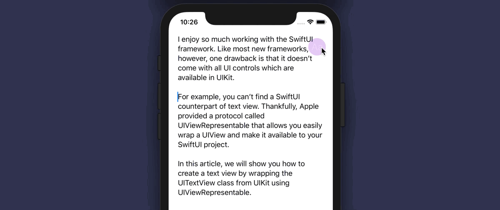

# Creating a SwiftUI TextView Using UIViewRepresentable

Like most new frameworks, however, one drawback is that it doesn’t come with all UI controls which are available in UIKit. For example, you can’t find a SwiftUI counterpart of text view. Thankfully, Apple provided a protocol called UIViewRepresentable that allows you easily wrap a UIView and make it available to your SwiftUI project.Like most new frameworks, however, one drawback is that it doesn’t come with all UI controls which are available in UIKit. For example, you can’t find a SwiftUI counterpart of text view. Thankfully, Apple provided a protocol called UIViewRepresentable that allows you easily wrap a UIView and make it available to your SwiftUI project.

This is a SwiftUI version of UITextView. For the detailed explanation of the implementation, please refer to the following tutorial:

https://www.appcoda.com/swiftui-textview-uiviewrepresentable
